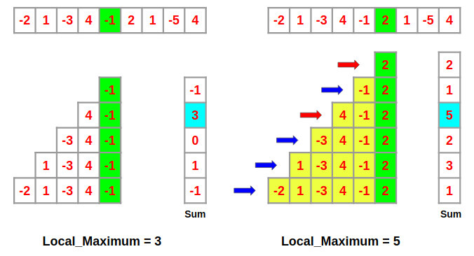

# Maximum Subarray

## Link

https://leetcode.com/problems/maximum-subarray/submissions/

## Where

Leetcode

## Difficulty

Easy

## Description

Given an integer array nums, find the contiguous subarray (containing at least one number) which has the largest sum and return its sum.

A subarray is a contiguous part of an array.

## Solution Main Idea

DP. Let local_max[i] be the biggest sum out of all possible subarrays that end at index i.

local_max[i] = max(nums[i], local_max[i-1] + nums[i])

in other words

local_max = max(nums[i], local_max + nums[i])

Get max of all local_max[i]'s to obtain answer
